# UnBrickIt User Guide

Welcome! This guide will help you install and use the UnBrickIt app to control your ScribIt wall drawing robot.

## Table of Contents

- [What is UnBrickIt?](#what-is-unbrickit)
- [Installation](#installation)
  - [macOS Installation](#macos-installation)
  - [Windows Installation](#windows-installation)
- [Getting Started](#getting-started)
- [Using the App](#using-the-app)
  - [Connecting to Your Device](#connecting-to-your-device)
  - [Uploading Firmware](#uploading-firmware)
  - [Drawing with SVG Files](#drawing-with-svg-files)
  - [Manual Control](#manual-control)
- [Troubleshooting](#troubleshooting)

---

## What is UnBrickIt?

UnBrickIt is a desktop application that helps you:

- **Update your ScribIt firmware** - Keep your drawing robot up to date
- **Upload drawings** - Convert SVG files to instructions your robot understands
- **Control the robot** - Move the drawing head manually and calibrate the pen position
- **Monitor progress** - Watch your robot draw in real-time

---

## Installation

### macOS Installation

#### Step 1: Download the App

1. Go to the [Releases page](https://github.com/karimi/unbrickit/releases)
2. Download the latest `.dmg` file (looks like `UnBrickIt-1.3.0.dmg`)

#### Step 2: Install the App

1. Open the downloaded `.dmg` file
2. Drag the **UnBrickIt** icon to your **Applications** folder

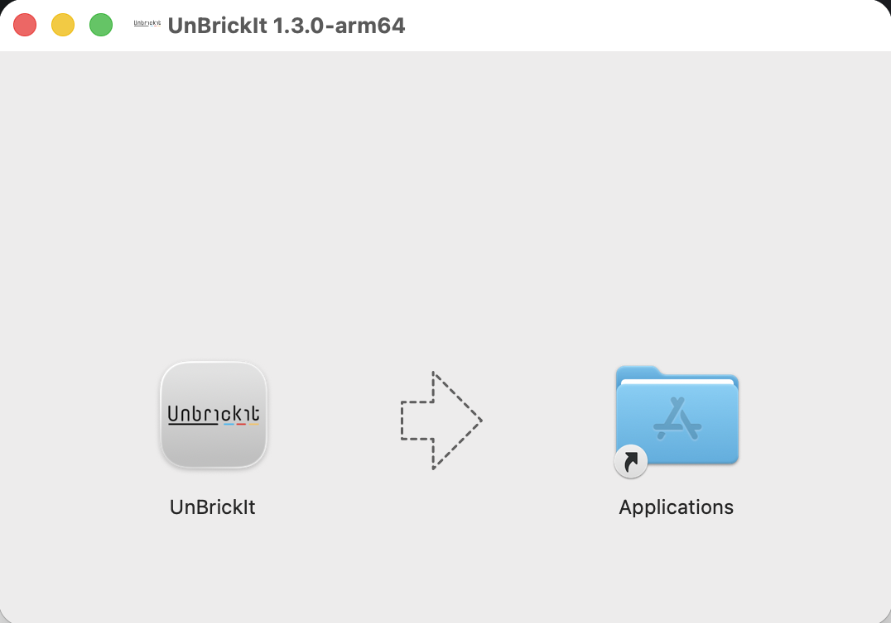

#### Step 3: Remove Security Block

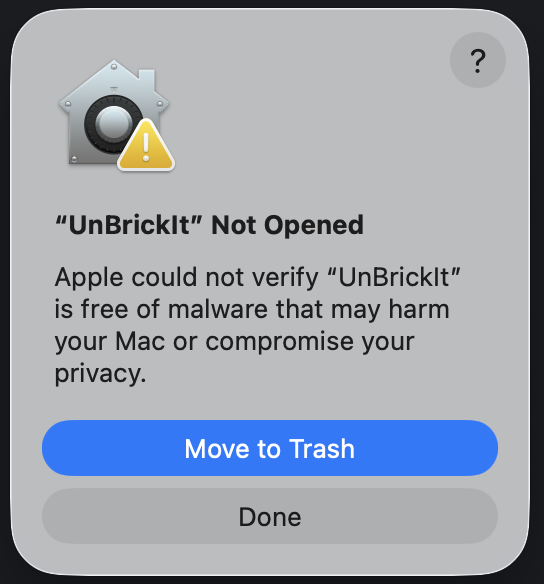

**Why is this step needed?**

macOS has a security feature called **Gatekeeper** that blocks apps from developers who haven't paid Apple for a yearly Developer Account ($99/year). Since this is a hobby project, the app isn't registered with Apple. This doesn't mean the app is unsafe - it just means I haven't paid Apple's fee.

**To allow the app to run:**

1. Open the **Terminal** app (found in Applications → Utilities)
2. Copy and paste this command, then press Enter:

   ```bash
   xattr -d com.apple.quarantine /Applications/UnBrickIt.app
   ```

3. You won't see any message if it worked - that's normal!

#### Step 4: Launch the App

1. Go to your **Applications** folder
2. Double-click **UnBrickIt**
3. The app should open without any warnings


**Alternative Method (if Terminal doesn't work):**

1. Try to open the app - you'll see a security warning
2. Click **OK** to close the warning
3. Open **System Preferences** → **Security & Privacy**
4. At the bottom, click **Open Anyway** next to the UnBrickIt message
5. Click **Open** in the confirmation dialog

---

### Windows Installation

#### Step 1: Download the App

1. Go to the [Releases page](https://github.com/karimi/unbrickit/releases)
2. Download the latest `.exe` file (looks like `UnBrickIt-Setup-1.3.0.exe`)

#### Step 2: Run the Installer

1. Double-click the downloaded `.exe` file
2. You may see a **Windows SmartScreen** warning

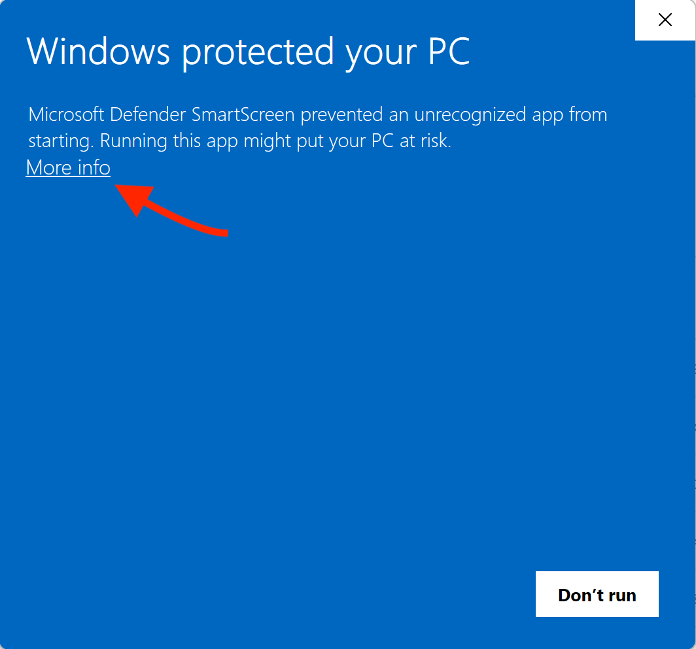

#### Step 3: Bypass SmartScreen

**Why is this step needed?**

Windows SmartScreen blocks apps from developers who haven't purchased a code-signing certificate (costs $300-500/year). Since this is a hobby project, the app isn't registered with Apple. This doesn't mean the app is unsafe - it just means I haven't paid for the certificate.

**To continue installation:**

1. Click **More info** on the SmartScreen warning
2. Click **Run anyway**

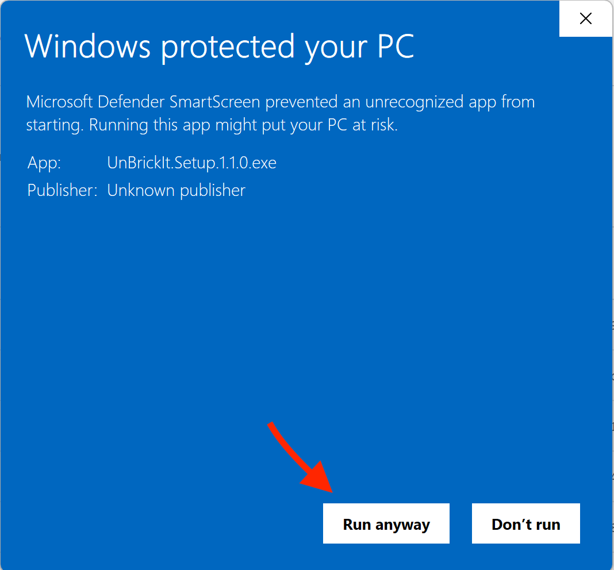

#### Step 4: Complete Installation

1. Follow the installation wizard (click **Next** → **Install**)
2. The app will install to your **Program Files** folder
3. Click **Finish** when done

#### Step 5: Launch the App

1. Find **UnBrickIt** in your Start Menu
2. Click to launch

---

## Getting Started

When you first open UnBrickIt, you'll see the connection screen.

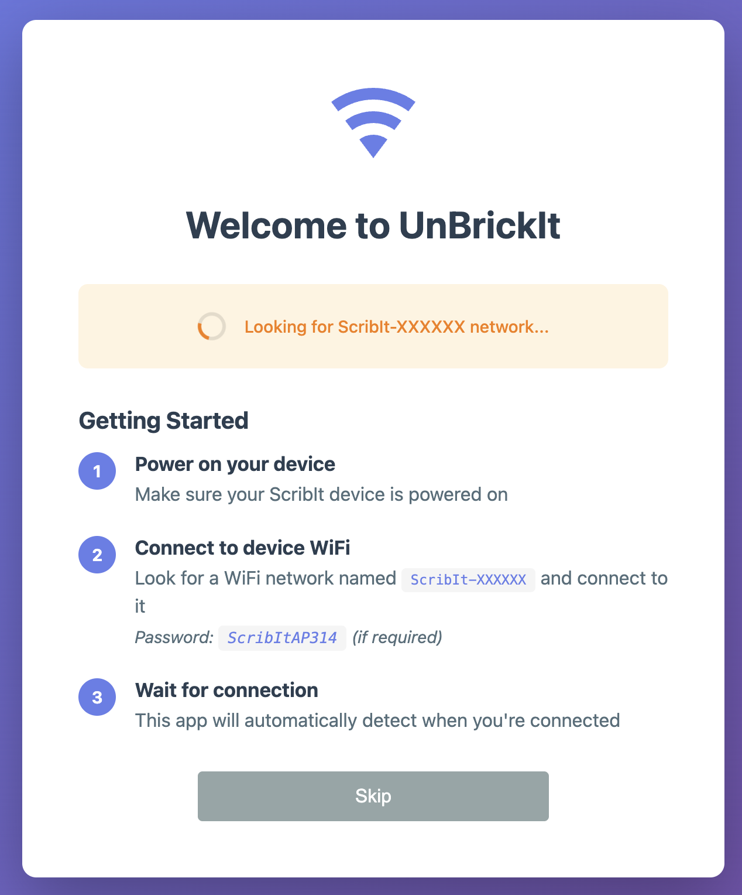

Before you can use the app, you need to connect it to your ScribIt device over WiFi.

---

## Using the App

### Connecting to Your Device

#### Step 1: Make Sure Your Device is On and hanging from the wall

1. Plug in your ScribIt robot
2. Wait for it to boot up (about 10-15 seconds)

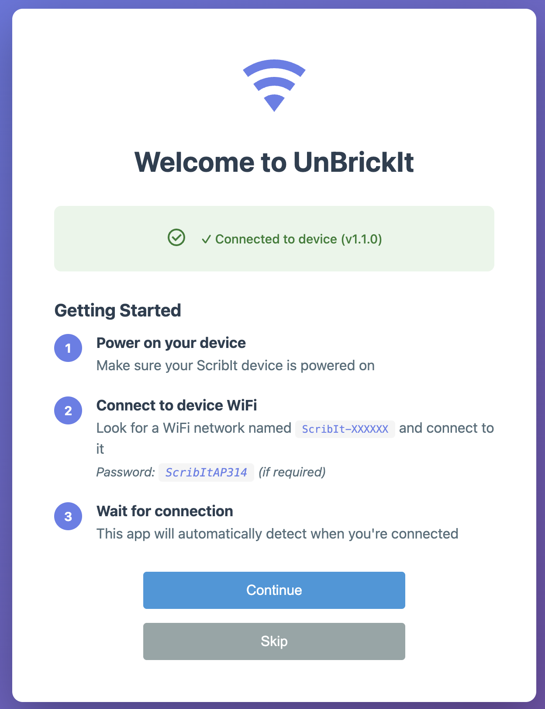

#### Step 2: Connect to you ScribIt Wi-Fi

1. On your computer look for a Wi-Fi network named `ScribIt-.....`
2. Connect to it (this will disconnect you from the internet, that's OK)

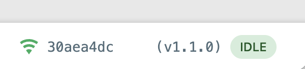

---

### Uploading Firmware

The first step to get your ScribIt working is to update the firmware. Firmware is the software that runs on your ScribIt robot. The original firmware depends on web services such as www.scribit.design that's not working anymore. We're replacing the firmware with a new version that bypasses this step and ways for us to controll it from the app.

**When to update firmware:**

- The first time you install UnBrickIt
- When a new version of UnBrickIt is released
- If your robot is behaving unexpectedly

#### Go to Firmware Upload

Click the **Firmware Upload** tab in the app and follow the steps.

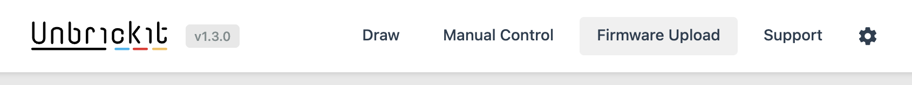

#### Step 1: Connect to ScribIt-..... Wi-Fi network

The left side of the LED on your device is a button, Hold it down for 5+ sec, device reboots. When back online connect to ScribIt-.... WiFi (password: `ScribItAP314` if needed)

#### Step 2: Send WiFi Credentials

The original firmware expects connectin to the internet, you need to send you home wifi name and password to the device to bypass this step. (we'll disable this feature in the new firmware)
You can also try sending a bogus network name and password, maybe it works (I haven't tested it)


#### Step 3: Connect to MBC-WB-.....

If previous step is successful, the device reboots and the LED light starts flashing faster. Now you shold see a new wi-fi network named `MBC-WB-.....`. Connect to it.


#### Step 4: Upload the firmeware in sequence

THe app will walk you through uploading three files to the device. Each upload will rebot the device, if upload is unsuccessfull try again.

1. Click **Upload ESP32 Firmware**
2. Wait for the upload to complete (this takes about 30 seconds)
3. The device will restart automatically
4. Wait 30 seconds for it to reconnect
5. Click **Upload SAMD21 Firmware**
6. Wait for completion
7. Upload **ESP32 partitions**

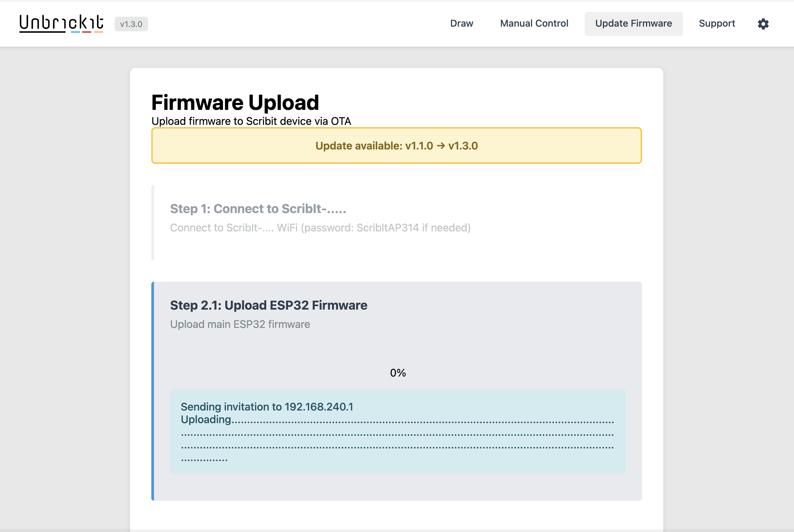

**Important:** Don't unplug the device during firmware upload!

---

### Drawing with SVG Files

SVG files are vector graphics that your robot can draw. You can create them in free software like [Inkscape](https://inkscape.org/).

#### Step 1: Go to SVG Converter

Click the **Draw** tab in the app.

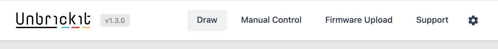

#### Step 2: Choose an SVG File

**Option A: Use a Sample**

The app includes sample drawings. Click on any sample to preview it:

- **Star** - A simple five-pointed star
- **Polyhedra** - A geometric shape
- **Jean Claude** - A portrait drawing

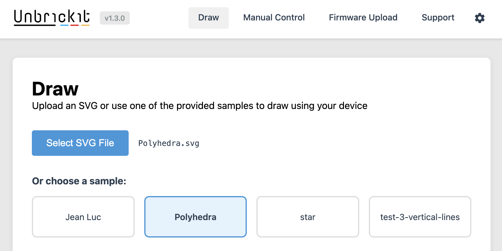

**Option B: Upload Your Own**

1. Click **Select SVG File**
2. Choose an `.svg` file from your computer

#### Step 3: Configure Drawing Settings

Before drawing, you need to measure three things on your wall:

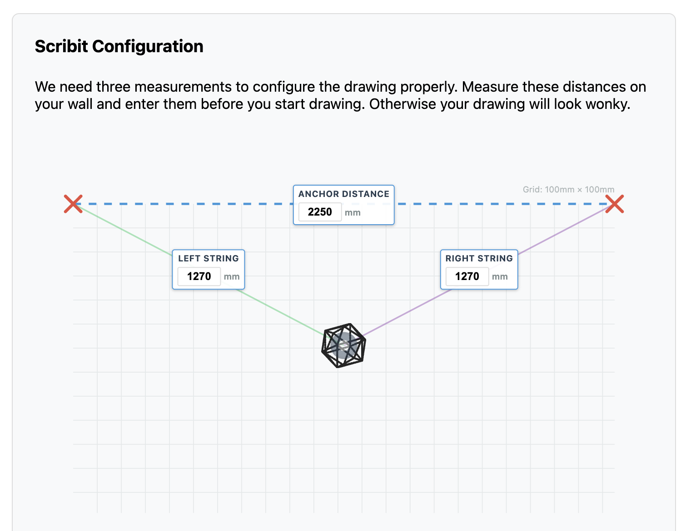

1. **Anchor Distance** - Distance between the two mounting points at the top
2. **Left String Length** - Length of the left string to the drawing gondola
3. **Right String Length** - Length of the right string to the drawing gondola

Measure these in millimeters and enter them in the app.

**Preview:**

The preview shows what your drawing will look like on the wall. Each grid square is 100mm × 100mm, so you can check if the size looks right.

You can adjust the **Scale** slider to make the drawing bigger or smaller.

#### Step 4: Calibrate the Pen

**This step is important!** Before drawing, make sure the pen holder is in the correct position.

1. Check the **"I've confirmed that the pen holder is calibrated"** box
2. Click the link to see the calibration diagram if you're unsure

**To calibrate:**
1. Go to the **Manual Control** tab
2. Click **Calibrate Pen Position**
3. The pen holder will rotate to the correct starting position (Pen 1 in up position)

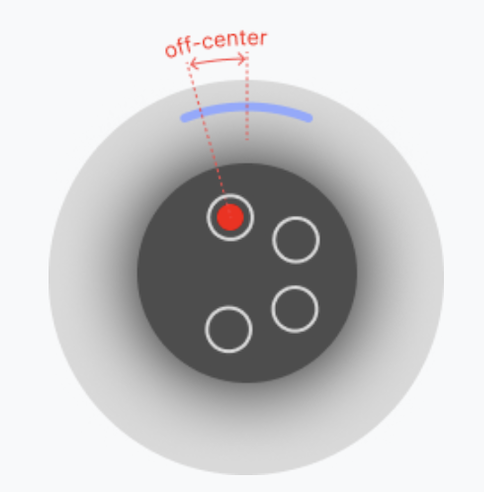

#### Step 5: Confirm Settings

Check the **"I've confirmed that the dimensions above are correct"** box.

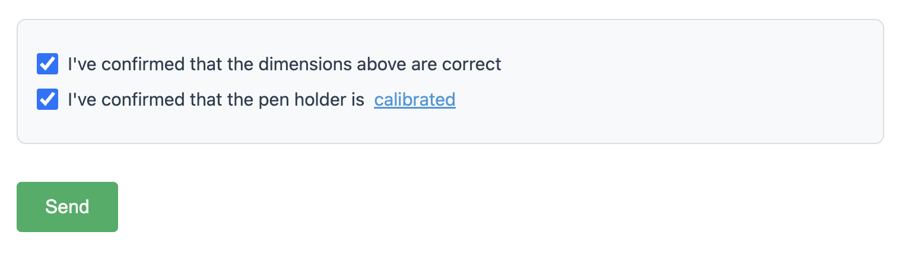

#### Step 6: Send the Drawing

1. Click the **Send** button
2. The robot will start drawing!
3. You can watch the progress in the status bar


**During Drawing:**

- **Pause** - Temporarily stop drawing (you can resume later)
- **Resume** - Continue drawing after pausing

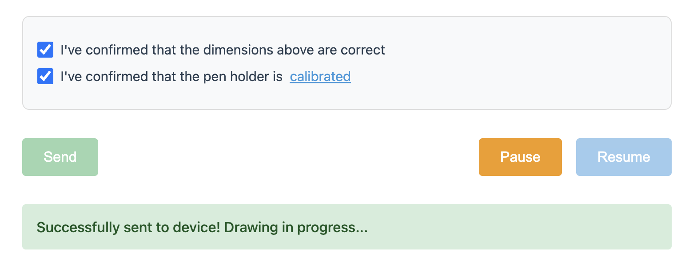

---

### Manual Control

Use Manual Control to test movements, calibrate the pen, and check your robot's position.

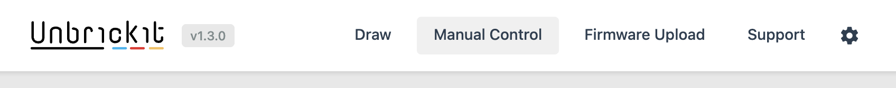

#### Movement Controls

- **Move Up/Down/Left/Right** - Move the gondola in small increments
- **Distance** - Change how far each movement goes (in mm)

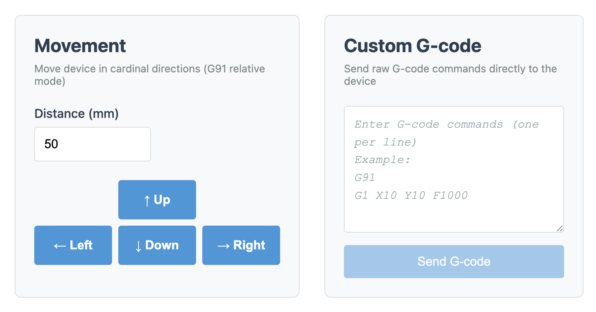

#### Pen Controls

- **Pen Down** - Lower the pen to touch the wall
- **Pen Up** - Raise the pen away from the wall
- **Switch Pen** - Rotate to the next pen (if you have a multi-pen holder)

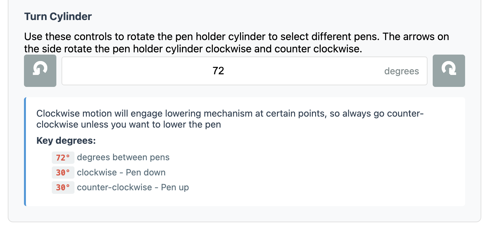

#### Calibration

- **Calibrate Pen Position** - Return pen holder to starting position (Pen 1 up)

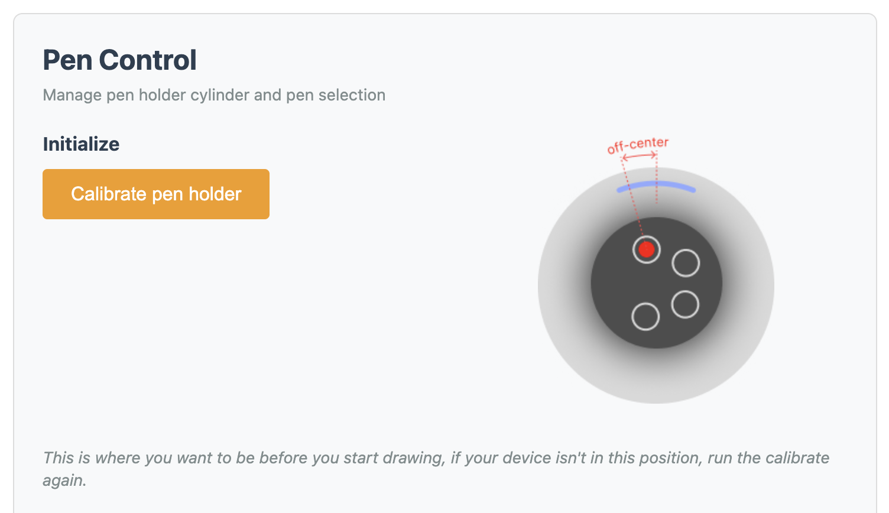

---

## Troubleshooting

### The app won't open on macOS

**Problem:** Double-clicking the app shows a security warning.

**Solution:** Follow the [macOS installation steps](#macos-installation) to remove the quarantine flag.

---

### The app won't install on Windows

**Problem:** Windows SmartScreen blocks the installer.

**Solution:** Click "More info" then "Run anyway" as shown in [Windows installation](#windows-installation).

---

### Can't connect to the device

**Problem:** App says "Connection failed" or "Device not found".

**Solutions:**
1. Make sure the device is powered on
2. Check that both your computer and device are on the same WiFi network
3. Verify the IP address is correct
4. Try pinging the device:
   - **macOS/Linux:** Open Terminal, type `ping 192.168.1.X` (replace with your device IP)
   - **Windows:** Open Command Prompt, type `ping 192.168.1.X`
5. Restart your device and try again

---

### Drawing looks distorted

**Problem:** Lines are the wrong length or curved when they should be straight.

**Solutions:**
1. Double-check your **measurements** (anchor distance, string lengths)
2. Measure in **millimeters** not inches
3. Make sure the strings aren't tangled or caught on anything
4. Update to the latest firmware version

---

### Firmware upload fails

**Problem:** Upload stops or shows an error.

**Solutions:**
1. Check the device is connected to WiFi
2. Make sure the IP address is correct
3. Try uploading again
4. Restart the device and reconnect
5. Check that you're not too far from your WiFi router (weak signal can cause upload failures)

---

### Drawing stops in the middle

**Problem:** Robot stops drawing before finishing.

**Solutions:**
1. Check if the drawing was paused (click Resume)
2. Make sure the device hasn't lost power
3. Check WiFi connection is stable
4. Check that strings aren't tangled

---

### Need More Help?

- **GitHub Issues:** [Report a problem](https://github.com/karimi/unbrickit/issues)
- **Source Code:** [View on GitHub](https://github.com/karimi/unbrickit)

---

## Tips for Best Results

### Creating SVG Files

- Use simple line drawings - complex fills may not draw well
- Keep stroke width at 1-2 pixels
- Test small drawings first before trying large ones
- Free software: [Inkscape](https://inkscape.org/), [Boxy SVG](https://boxy-svg.com/)

### Measuring Your Setup

- Use a tape measure or laser measure for accuracy
- Measure to the center of the gondola, not the edge
- Write down your measurements so you don't have to re-measure every time

### Drawing

- Start with a simple shape (like the star sample) to test
- Make sure the pen tip is making good contact with the wall
- Clean the wall surface before drawing (dust affects pen quality)
- Keep the pen filled with ink (dry pens create gaps in lines)

---

**Enjoy your drawing robot!** 🎨
